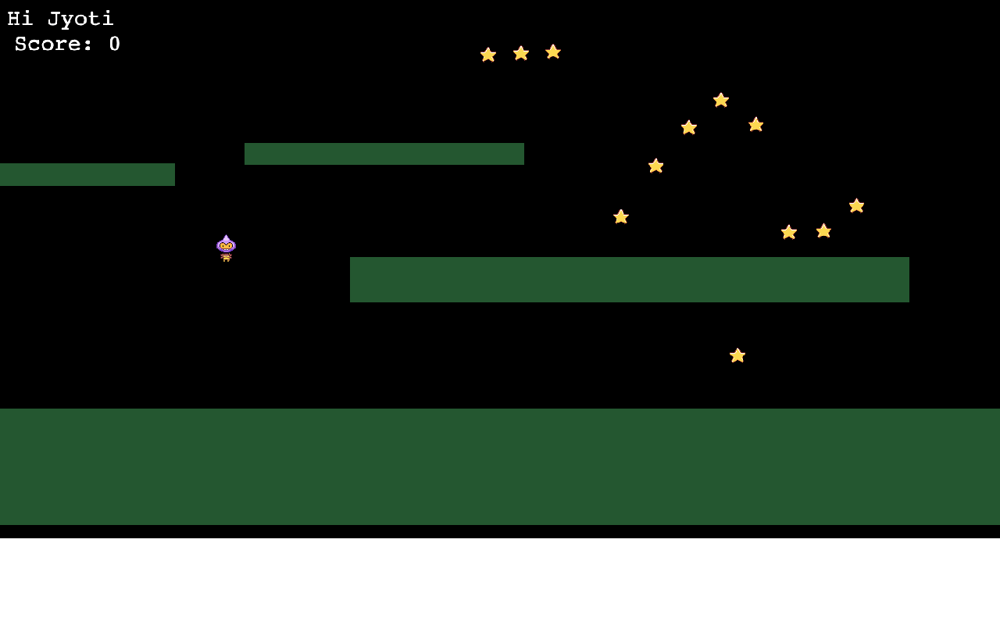

# JS-Game
This is capstone project for Microverse Main Technical Curriculum - Javascript section. This project consisted of building turn based RPG game using Phaser 3 library.

## Live Demo

https://loving-jennings-668614.netlify.app/

## Video Description

https://www.loom.com/share/d76577639efc4266bb8124e99a045fe1

## How to Play

# Getting Started

One user can either play the game online by clicking here OR Clone from the git here, the process of cloning are listed below in the getting started part.

# Scene-GameMenu:

1. It will have two options - Play and Highscore.
2. If the user clicks on Play, the scene to enter the player name will load.
3. Once user enters the name, and click on submit. The game will start.
4. If the user clicks on Highscore, the highest score will be displayed.

# Scene - Main
1. User can see a character/avatar on the screen at this point. The avatar can move up/down.left/right by using the keyboard arrow keys.
2. The avatar/character can earn a point/score by catching the stars which are falling from the top.
3. The avatar/character will die if it encounters with a bomb.
4. The bomb appears only after the avatar has already collected 4 stars.

## Built With

- JavaScript
- Phaser 3
- Webpack
- Eslint
- Babel
- Jest
- Express
- Github
- Netlify
- [Leaderboard API service][LB-API] for the leaderboard

## Getting Started

# Prerequisites:

To get this project up and running locally, "npm install" is needed to be run in order to include all dependencies used for this project.

# To get this project set up on your local machine, follow these simple steps:

1. Open Terminal.
2. Navigate to your desired location to download the contents of this repository.
3. Copy and paste the following code into the Terminal: git clone https://github.com/jrai0792/JS-Game
4. Run "npm install".
5. Run "npm run webpack-dev-server".

## Authors

👤 **Jyoti Rai**

- GitHub: [@JyotiRai](https://github.com/jrai0792)
- Twitter: [@JyotiRai](https://twitter.com/jyotirai0792)
- LinkedIn: [@JyotiRai](https://linkedin.com/in/rai-jyoti)

## Show your support

Give a ⭐️ if you like this project!

## 📝 License

This project is [MIT](./MIT.md) licensed.